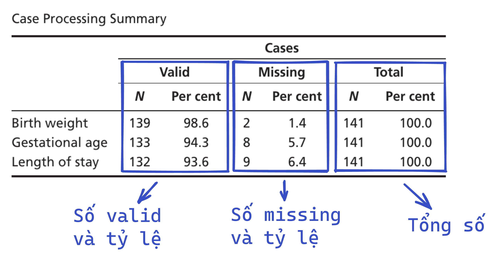
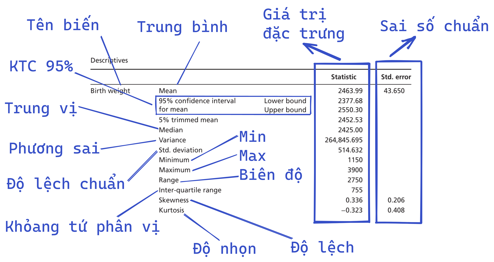

## Mô tả biến định lượng bằng Explore

Cách thực hiện:

- Analyze → Descriptive Statistics → Explore
- Explore
  - Chọn (các) biến định lượng và chuyển vào Dependent List
  - Display: tick Both (default)
  - Click Statistics
- Explore: Statistics
  - Click Descriptives (default), Confidence Interval for Mean: 95% (default)
  - Click on Outliers
  - Click Continue
- Explore
  - Click Plots
- Explore: Plots
  - Boxplots – Chọn Factor levels together (default)
  - Descriptive – Bỏ tick Stem and leaf (default), tick Histogram và tick Normality plots with tests
  - Click Continue
- Explore
  - Click on Options
- Explore: Options
  - Missing values – tick Exclude cases pairwise, Click Continue
- Explore
  - Click OK

Đọc kết quả:

- Vd: Biến cân nặng lúc sinh có tổng cộng 141 quan sát, missing 2 quan sát (chiếm 1.4%)

- Vd: Cân nặng lúc sinh trung bình là 2463.99, với sai số chuẩn (của số trung bình) là 43.650
- Vd: Khỏang tin cậy 95% của cân nặng lúc sinh là 2377.68 - 2550.30
