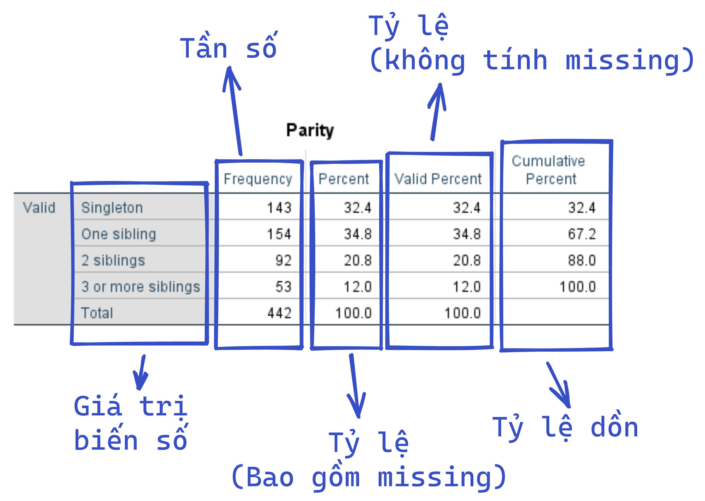

## Bảng phân phối tần số một chiều

Cách thực hiện:

- Analyze → Descriptive statistics → Frequencies
- Frequencies:
  - Chọn biến
  - Click Ok

Đọc kết quả:

- Cột Percent và Valid percent giống nhau trong trường hợp không có missing
- Đối với tỷ lệ: Đọc cột Valid percent

- Vd: Số quan sát chỉ có 1 anh chị em (one sibling) là 154, chiếm 34.8%
- Vd: 67.2% các quan sát có từ 1 anh chị em trở xuống
- Vd: 32.8% (100% - 67.2%) các quan sát có từ 2 anh chị em trở lên